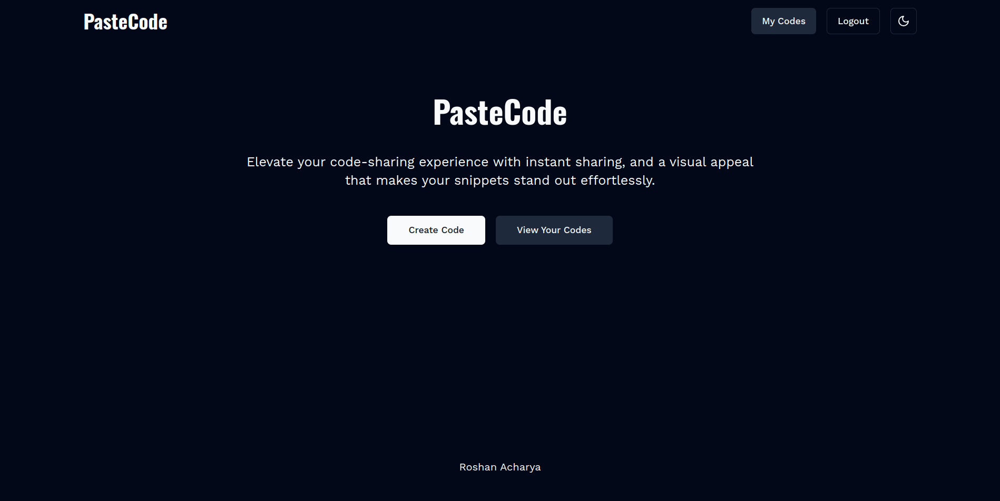
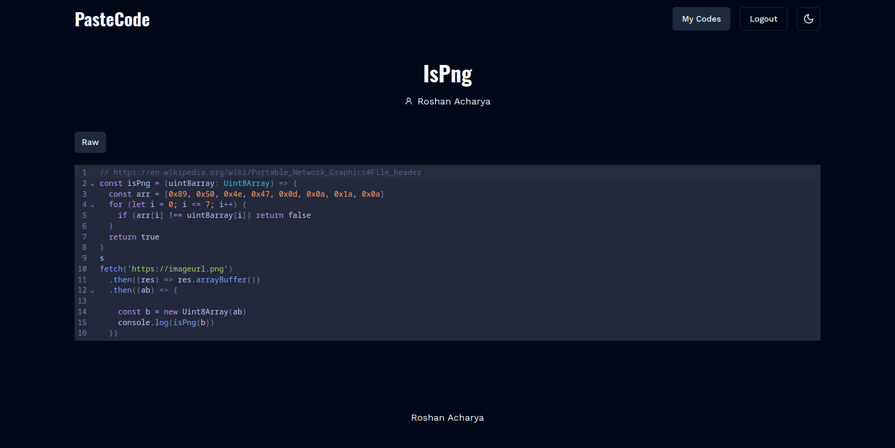
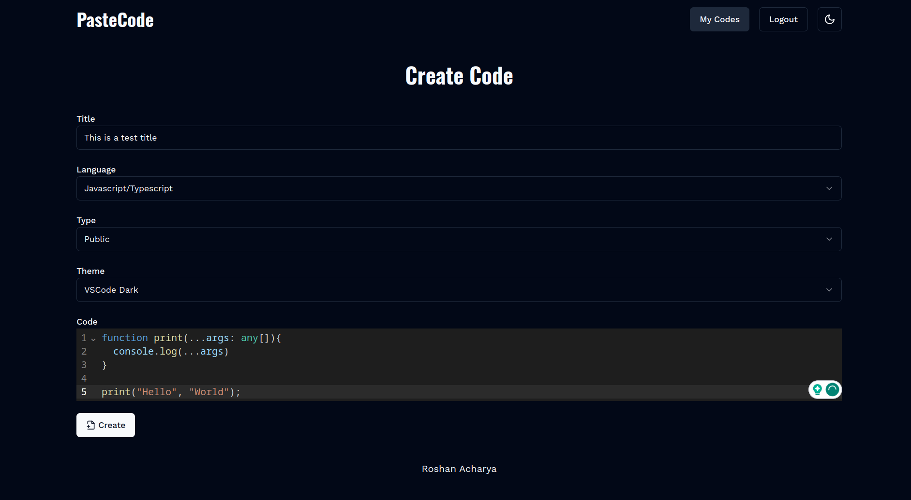

<h1 align="center">PasteCode</h1>

### Setup

```sh
git clone git@github.com:coderosh/pastecode.git

cd pastecode

yarn install

yarn drizzle:g
yarn drizzle:p

yarn dev
```

> Nothing interesting—just me learning Next.js server actions.

### Supported Themes

- Tokyonight
- Tokyonight Storm
- Nord
- Vscode Dark
- Material Dark
- Github Dark

### Supported Langauges

- Javascript/Typescript
- Python
- CSS

### Screenshots




